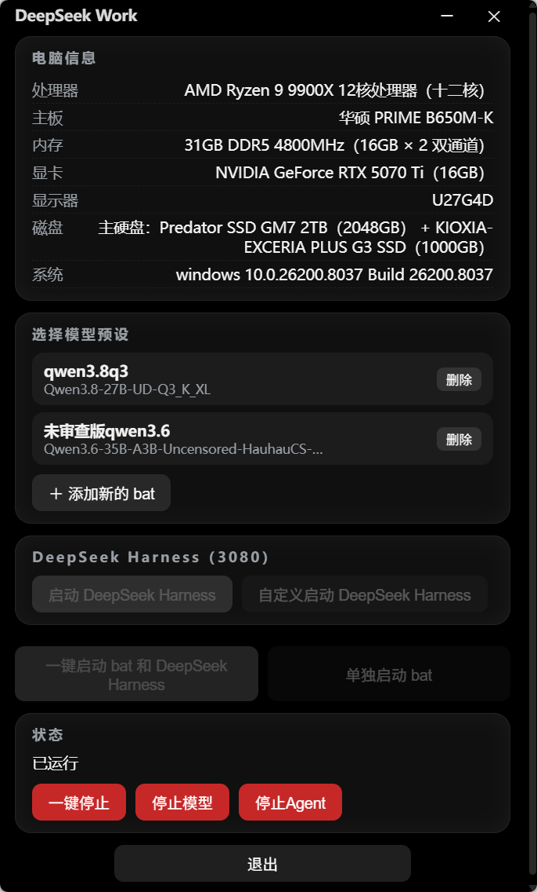

# DeepSeek Work



一个单文件的 Windows 桌面小工具：**管理本地大模型的启动** —— 点选模型预设、一键启动，程序自动把模型（llama.cpp）跑起来，就绪后用独立 Chrome 页面打开 DeepSeek Harness（Web 界面）。全程不用敲命令。

- **交付物**：`build\bin\DeepSeek Work.exe`，双击即可运行，无安装步骤
- **技术栈**：Go + Wails v2，前端原生 HTML/CSS/JS（`go:embed` 内嵌），无 CGO，单文件交付
- **更多文档**：[设计文档](docs/设计文档.md) · [版本历史](docs/CHANGELOG.md)

## 快速开始（3 步用起来）

> 前提：本机已装好 llama.cpp（提供 `llama-server`）与 DeepSeek Harness（提供 `dsh` 命令），并有一个启动模型的 `.bat` 脚本。本工具只负责"替你点击"，不安装、不修改任何依赖。

1. **打开程序**：双击根目录的 `启动DeepSeek Work.bat`（等价于直接运行 `build\bin\DeepSeek Work.exe`）。
2. **添加并选中预设**：点「＋ 添加新的 bat」，在弹窗里选中你的模型启动脚本；然后在列表里**点击那一行**选中（行会变高亮，再点一次取消）。
3. **一键启动**：点「一键启动 bat 和 DeepSeek Harness」。程序会依次自动完成：
   启动模型（新控制台窗口，可看日志）→ 每 1 秒检查 8080 端口、最长等 180 秒 → 模型就绪后自动启动 DeepSeek Harness（3080）→ 用**独立 Chrome 页面**打开 `http://127.0.0.1:3080`。

用完点「**一键停止**」同时停掉模型和 DeepSeek Harness（也可用「停止模型」「停止Agent」分别停）；三个停止按钮**实时显隐**：对应目标运行中才出现，停掉后自动隐藏。最后点「**退出**」关闭本工具（模型还在跑时会先问你是否一并停止）。

## 界面导览

上图即主界面，各区域作用：

| 区域 | 说明 |
|------|------|
| 电脑信息卡片 | 处理器/主板/内存/显卡/显示器/磁盘/系统（启动时获取一次，多显卡/多硬盘用「＋」连接显示在同一行） |
| 选择模型预设 | 每个 bat 一行：点行选中（高亮）、再点一次取消（**必须选中才能启动**），右侧「删除」按钮单独移除该预设（不删 bat 文件）；「＋ 添加新的 bat」打开文件对话框（预设只从这里添加，不自动扫描目录） |
| 一键启动 / 单独启动 | Harness 卡片下方：「一键启动 bat 和 DeepSeek Harness」（完整流程：bat→轮询 8080→Harness→独立 Chrome 页面；默认带上输入框里当前的 DSH 启动参数）＋「单独启动 bat」（只跑所选 bat）；未选中预设时两按钮置灰 |
| DeepSeek Harness（3080） | 「自定义启动 DeepSeek Harness」展开/收起命令输入框（默认收起，持久化）+「启动 DeepSeek Harness」（就绪后用独立 Chrome 新页面打开 3080） |
| 状态区 | 显示当前阶段（空闲/启动中/就绪/超时/错误）；启动中会出现「跳过等待」；「一键停止 / 停止模型 / 停止Agent」按模型与 Agent 的真实运行状态实时显隐（运行中显示，停止后隐藏）；无流程运行时状态栏按真实状态显示「已运行/空闲」 |
| 标题栏 | 可拖动；右上角最小化 / 关闭 |
| 退出 | 底部按钮，行为见下 |

## 功能清单（详细版）

1. **电脑信息（详细版，兼容各种电脑）**：处理器（型号+核数，中文核数「（十二核）」）/ 主板（中文厂商+型号）/ 内存（容量+代际+频率+「16GB × 2 双通道」式插槽构成）/ 显卡（集成/独立分行，含显存与厂商，NVIDIA 显存取 nvidia-smi）/ 显示器（型号+英寸）/ 磁盘（型号+十进制容量，C 盘所在盘标「主硬盘」置顶）/ 系统版本。启动时获取一次（不实时刷新）；每一项独立采集、独立降级，任何一台 Windows 电脑取不到的项显示「—」，不弹窗。
2. **窗口拖动 / 拉伸**：wails v2 内置无边框机制 —— 标题栏声明 `--wails-draggable: drag`，mousedown 后由 wails 在 UI 线程 `PostMessage(WM_NCLBUTTONDOWN, HTCAPTION)`，**Windows 系统移动循环接管**，与资源管理器窗口同一套机制、完全一致的手感；窗口四边 6px 内原生缩放（光标变箭头，拖边/角拉伸）。
3. **模型预设列表（手动添加，持久化）**：预设只来自「＋ 添加新的 bat」持久化到 `config.json` 的 `extraBats`（也可直接编辑该数组）；**点预设行选中**（高亮，**再点一次取消选中**；**必须选中后才可启动**，未选中时下方启动按钮置灰）；每行右侧「删除」按钮可单独移除该预设（只移出列表，**不删 bat 文件**）；自动去除文件名开头序号，副标题显示 gguf 模型名；缺失文件整行变暗标「文件缺失」且不可选；列表为空时显示空态提示。
4. **一键启动（Harness 卡片下方，作用于选中的预设行）**：
   - 「一键启动 bat 和 DeepSeek Harness」：新控制台窗口运行 bat（保留 llama-server 日志屏），每 1s 轮询 8080（最长 180s），就绪后自动确保 DeepSeek Harness 就绪并**用独立 Chrome 新页面打开**（Chrome 缺失回退系统默认浏览器）。
   - **默认带上启动参数**：一键启动时自动持久化「自定义启动」输入框里**当前**的 DSH 启动参数（输入框非空才覆盖；留空则沿用已保存值），随后按该参数启动 harness。
   - 「单独启动 bat」：只在新控制台窗口运行所选 bat —— **不轮询、不启动 DeepSeek Harness**（之后可随时手动点「启动 DeepSeek Harness」）。
   - 启动进行中（等待 8080）两按钮禁用；8080 已占用时弹窗提示。
5. **DeepSeek Harness（3080）卡片**：
   - 「自定义启动 DeepSeek Harness」：展开/收起上方的命令输入框（**默认收起**；展开时按钮高亮）。
   - 命令输入框 = harness 完整启动命令行（`harnessCmd`，默认 `dsh.cmd web --no-open --port 3080`，**可改成任意命令**——其他 web 服务、其他工具都行，经 `cmd.exe /c` 隐藏执行，端口就绪探测仍用 `harnessPort`）。
   - **参数改动立即生效**：改完输入框后无需重启应用，下一次启动（一键启动 / 启动 DeepSeek Harness / 跳过等待）都用最新参数。
   - 「启动 DeepSeek Harness」：3080 已在监听则**复用**（绝不重复启动），否则跑自定义命令并等就绪（30s），成功后**用独立 Chrome 新页面打开** `http://127.0.0.1:3080`（`chrome.exe --new-window`，Chrome 缺失回退系统默认浏览器）。
   - 命令引用的文件不存在 → 立即报错（不等 30s 超时）。
   - **按钮实时置灰**：DeepSeek Harness 运行中（3080 监听）时「启动 DeepSeek Harness」与「自定义启动 DeepSeek Harness」均置灰且不可点击，停止后 1.5 秒内自动恢复。
6. **添加新的 bat**：原生文件对话框选择 .bat，持久化到 `config.json`（`scanFolder` 仅作为对话框默认目录），重启后仍在；文件被删除则该行标「缺失」。
7. **单独启动脚本**：`启动DeepSeek Work.bat`（项目根目录），双击即可启动 `build\bin\DeepSeek Work.exe`，无需手动进目录。
8. **跳过等待 / 一键停止 / 停止模型 / 停止Agent / 退出**：
    - 跳过等待：放弃 8080 轮询，直接打开 DeepSeek Harness（模型继续加载）。
    - 一键停止：同时停掉模型与 DeepSeek Harness，各自「端口(8080/3080) → PID → `taskkill /T /F` 整树」定位，外部启动/复用的 Harness 也能停；都不在运行时提示「没有运行中的」，幂等可重复点。
    - 停止模型：只停本地模型（优先杀跟踪到的进程树，否则按 8080 端口定位）。
    - 停止Agent：只停 DeepSeek Harness（按 3080 端口定位进程树）。
    - **停止按钮实时显隐**：前端每 1.5s 轮询后端 `Status()`（端口监听探测）——模型运行中才显示「停止模型」，Agent 运行中才显示「停止Agent」，任一在运行就显示「一键停止」；全部停止后三者均隐藏。
    - 退出：模型运行中会询问「要一并停止吗？」，是 = 停模型与 Agent 并退出，否 = 仅退出（模型继续跑）。

9. **状态栏「已运行/空闲」**：无启动流程时状态栏按真实运行状态显示——模型或 DeepSeek Harness 任一在运行显示「已运行」，全部停止显示「空闲」（前端每 1.5 秒轮询端口状态；启动进度/错误/超时文本保留不被覆盖）。

## 使用说明

### 端口约定

- 模型服务：`8080`（`modelPort`）
- DeepSeek Harness：`3080`（`harnessPort`），已在监听则复用，绝不重复启动。

### 打开 DeepSeek Harness 的方式

- **独立 Chrome 新页面**：点「启动 DeepSeek Harness」或一键启动流程就绪后，自动用 `chrome.exe --new-window http://127.0.0.1:3080` 打开独立 Chrome 页面；Chrome 不存在时回退系统默认浏览器（`rundll32 url.dll,FileProtocolHandler`）。

## config.json

固定位置：**C 盘用户 AppData** —— `%APPDATA%\DeepSeek Work\config.json`（即 `C:\Users\<用户名>\AppData\Roaming\DeepSeek Work\config.json`，目录名与 exe 一致）。文件缺失/损坏会自动重建默认值。

WebView2 浏览器数据目录也固定在该目录下：`%APPDATA%\DeepSeek Work\EBWebView`（与 config 同目录）。旧版本若把浏览器数据放在 `%APPDATA%\<exe名>.exe\EBWebView`，可手动移过来续用。

| 字段 | 默认值 | 说明 |
|------|--------|------|
| `scanFolder` | `D:\Program Files\Llama` | 仅作「添加新的 bat」对话框默认目录，不扫描 |
| `extraBats` | `[]` | 通过「添加新的 bat」持久化的预设（预设唯一来源） |
| `modelPort` | `8080` | 模型端口 |
| `harnessPort` | `3080` | Harness 端口（就绪探测端口，Chrome 页面地址 = `http://127.0.0.1:<端口>`） |
| `chromePath` | `C:\Program Files\Google\Chrome\Application\chrome.exe` | Chrome 路径（打开独立 Chrome 页面用；未设置/不存在则回退系统默认浏览器） |
| `harnessCmd` | `dsh.cmd web --no-open --port 3080`（带本机绝对路径） | harness 完整启动命令行（可自定义任意命令，经 `cmd /c` 隐藏执行） |

## 预设管理

- 预设 = `extraBats`（「＋ 添加新的 bat」持久化），按绝对路径去重、按名称排序；**不扫描目录**；每行「删除」按钮单独移除（持久化，不删 bat 文件）。
- 每个 bat 的展示名 = 文件名去 `.bat` 与开头序号/分隔符；副标题 = bat 内 `MODEL_PATH=` 的模型文件名。
- 也可直接编辑 `%APPDATA%\DeepSeek Work\config.json` 的 `extraBats` 数组（每个元素一个 bat 绝对路径），重启本工具生效。
- 旧版 config 位置自动迁移：`%APPDATA%\ai-starter\config.json` 会在首次启动时自动复制到新位置（不覆盖新位置已有配置，旧文件保留）。更早版本写在 exe 同目录的 config.json 需手动复制过去。

## 退出行为

- 模型未运行：直接退出。
- 模型运行中：询问是否一并停止。「是」→ 杀整棵模型进程树后退出；「否」→ 仅退出本工具，llama-server 继续运行（8080 仍监听，下次启动会提示端口占用）。

## 故障排查

| 现象 | 处理 |
|------|------|
| 「启动命令引用的文件不存在：…」 | 命令第一个 token 是文件路径但该文件不在（如 dsh 重装后 npm 全局目录变了）→ 改 `config.json` 的 `harnessCmd` 或卡片里的命令输入框 |
| 「DeepSeek Harness 启动超时（30s）」 | 手动运行卡片里那条启动命令看报错；或确认 3080 未被其他程序占坏 |
| 「8080 已占用」 | 已有模型在跑：选「是」只开 DeepSeek Harness；或先用「一键停止」/「停止模型」/任务管理器清理 |
| 「启动超时（180s）」 | 查看模型控制台窗口：常见为显存不足（OOM）。Qwen3.8-27B Q3 需约 16GB 显存，可在 bat 里把 `-ngl all` 改为 `-ngl 55` 左右降级 |
| 预设行变暗显示「文件缺失」 | bat 文件被移动/删除；可点该行「删除」移除，或用「＋ 添加新的 bat」重新添加实际位置 |
| 毛玻璃无效果 | 某些 Windows 版本/显卡组合不支持 `backdrop-filter`，窗口退化为深色不透明主题，功能不受影响 |
| config.json 被改坏 | 删掉即可，下次启动自动重建默认值 |

## 仓库结构

```
DeepSeek Work/
├── main.go               # Wails 入口（窗口选项、embed 前端资产）
├── app.go                # 前端绑定与流程编排（启动/轮询/跳过/停止/退出）
├── config.go             # config.json 读写、默认值、旧配置迁移
├── presets.go            # 预设列表（去重/排序/命名解析）
├── sysinfo.go            # 电脑信息采集（WMI/nvidia-smi/gopsutil，逐行降级）
├── launcher.go           # 端口探测、bat 启动（CreateProcessW）、进程管理、浏览器
├── frontend/             # UI（index.html / app.js / styles.css + wailsjs 绑定）
├── build/                # 图标与 wails 构建配置（windows/info.json、manifest 等）
├── docs/                 # 设计文档、变更历史、主界面截图
├── 启动DeepSeek Work.bat # 双击启动入口
├── wails.json            # wails 构建配置（输出名 DeepSeek Work）
└── go.mod                # Go 模块（go 1.27，wails v2.15）
```

## 开发

依赖：Go 1.27+、[Wails CLI](https://wails.io) v2（`go install github.com/wailsapp/wails/v2/cmd/wails@latest`）。

```powershell
go vet ./...    # 静态检查
wails build     # 构建 build\bin\DeepSeek Work.exe（会自动重新生成 frontend\wailsjs 绑定）
```
